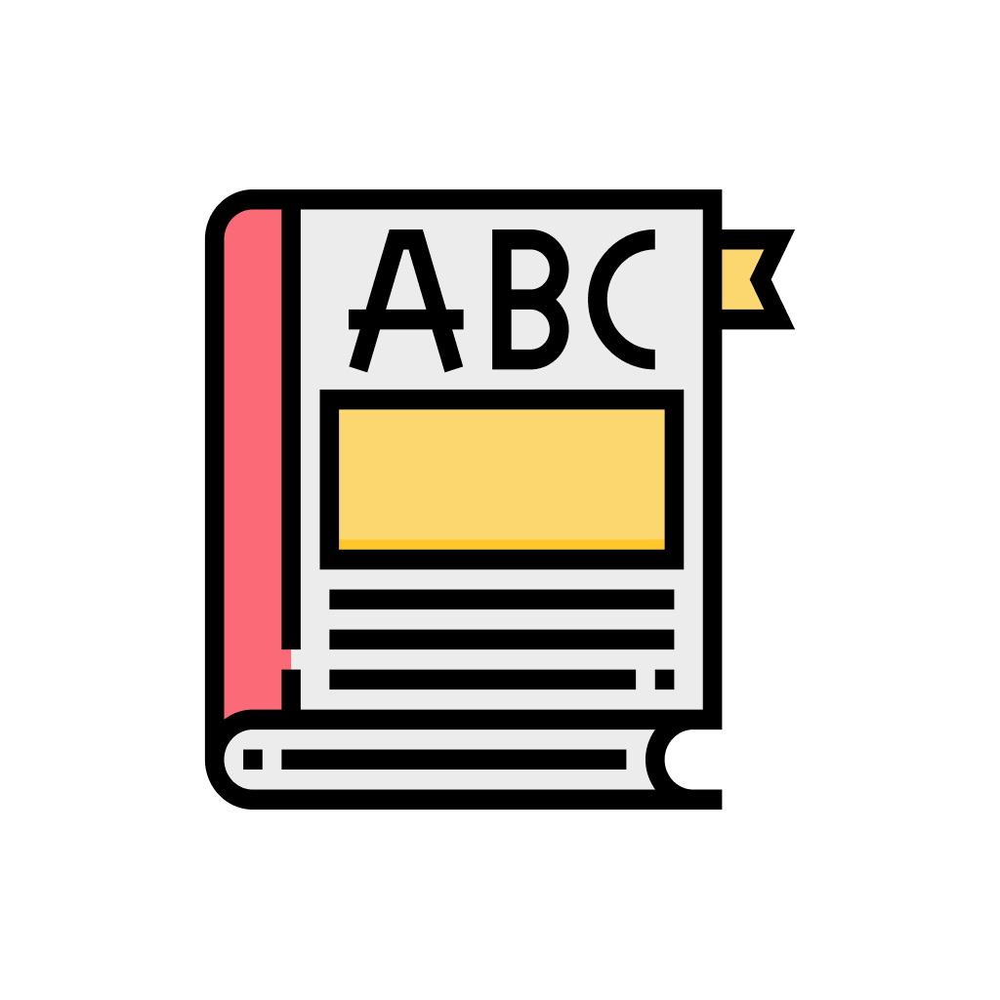
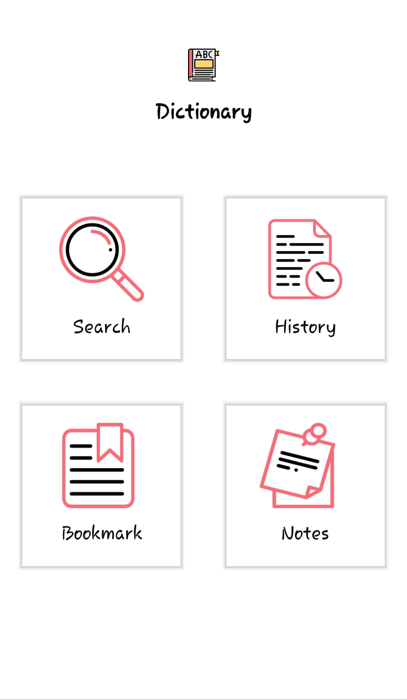
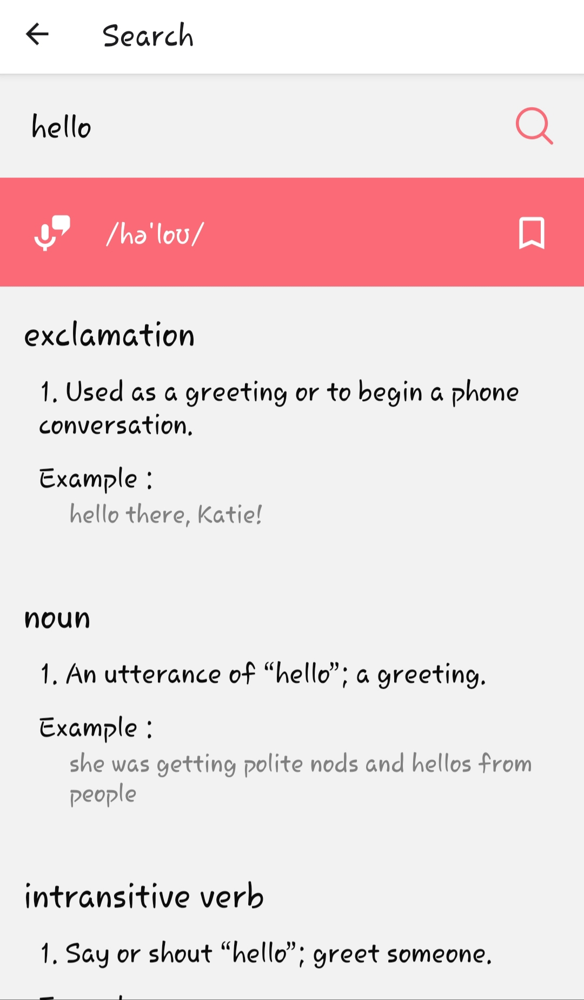
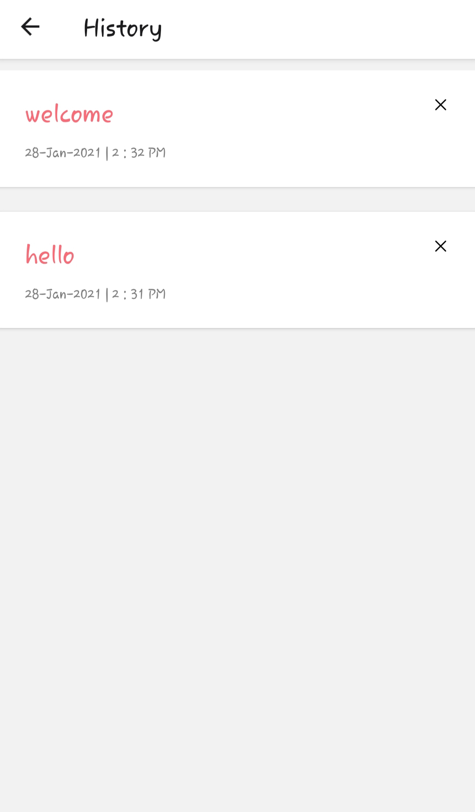
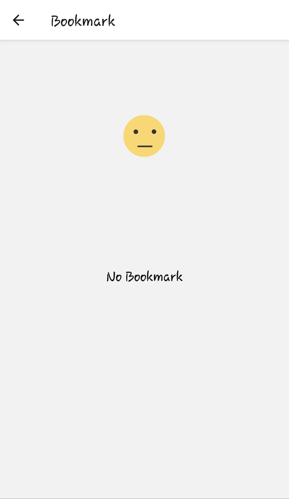
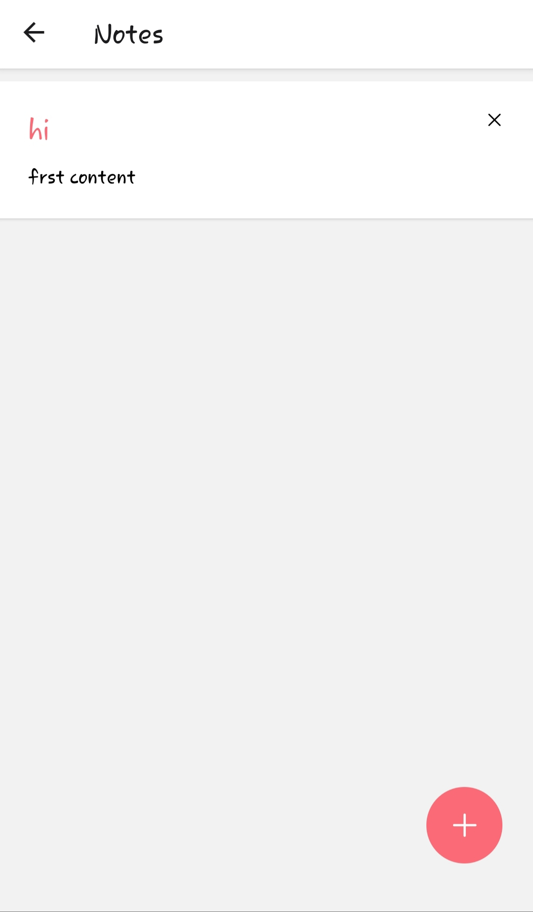
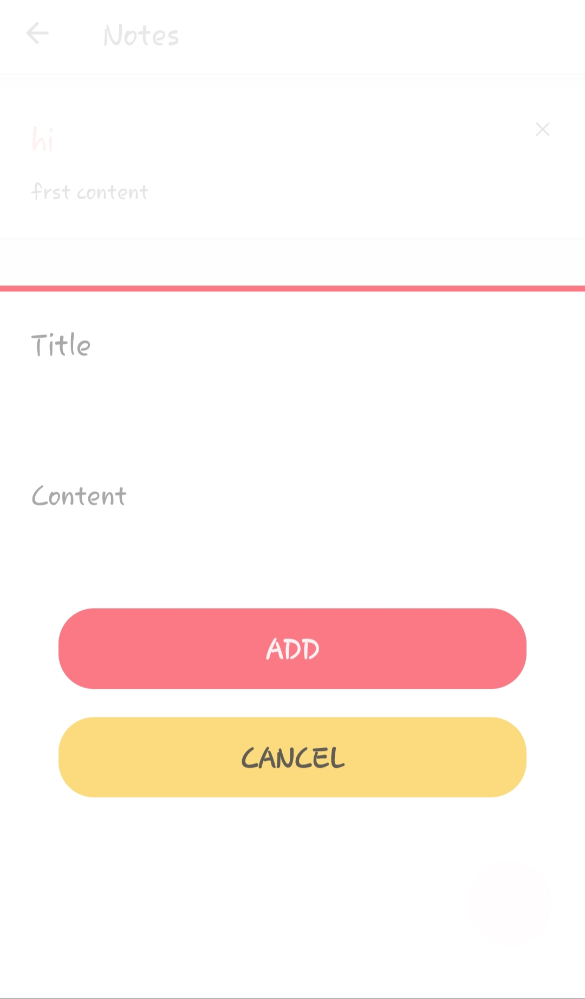

<h1 align="center">
 DICTIONARY
</h1>

  &emsp;&emsp;&emsp; A simple free and open-source dictionary app that uses the API created by [Meet Developer](https://github.com/meetDeveloper) which you can check out [here](https://github.com/meetDeveloper/googleDictionaryAPI). This dictionary app uses that API to show definitions for the words entered by the user.
 

## Screenshots

  

  

  

  

  

  

